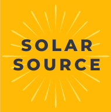
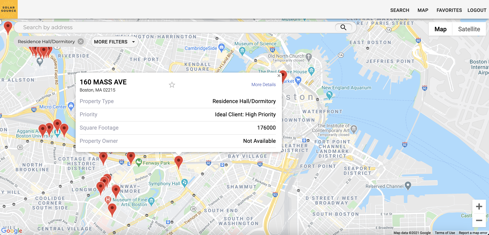

# Solar Source

<!-- PROJECT SHIELDS -->

<!-- [![Contributors][contributors-shield]][contributors-url]
[![Forks][forks-shield]][forks-url]
[![Stargazers][stars-shield]][stars-url]
[![Issues][issues-shield]][issues-url]
[![MIT License][license-shield]][license-url]
[![LinkedIn][linkedin-shield]][linkedin-url] -->

<!-- PROJECT LOGO -->

<!-- TABLE OF CONTENTS -->

  
Table of Contents

  <ol>
    <li>
      <a href="#about-the-project">About The Project</a>
      <ul>
        <li><a href="#design-process">Design Process</a></li>
        <li><a href="#built-with">Built With</a></li>
      </ul>
    </li>
    <li>
      <a href="#getting-started">Getting Started</a>
      <ul>
        <!-- <li><a href="#prerequisites">Prerequisites</a></li> -->
        <li><a href="#installation">Installation</a></li>
      </ul>
    </li>
    <!-- <li><a href="#usage">Usage</a></li> -->
    <li><a href="#roadmap">Roadmap</a></li>
    <li><a href="#contributing">Contributing</a></li>
    <li><a href="#license">License</a></li>
    <li><a href="#contributors">Contributors</a></li>
    <!-- <li><a href="#acknowledgements">Acknowledgements</a></li> -->
  </ol>

<!-- ABOUT THE PROJECT -->

## About The Project

**FIRST PLACE WINNER - February 2021 Sustainable Cities Hackathon**

Designed and built in 3.5 days by General Assembly SEI, DSI, and UX/UI graduates for the GA Feburuary 2021 Sustainable Cities Hackathon.

Solar Source is a full stack application designed for solar developers and sales-people for lead generation.

### Design Process

- [Figma Wireframes]()
- [Final Presentation Slide Deck]()
- [Initial Sketches]()
- [Competative Analysis]()
- [Comparative Analysis]()

### Built With

- [ReactJS]()
- [MaterialUI]()
- [GoogleMapsAPI]()
- 

### DataSets

- 
- 

<!-- GETTING STARTED -->

## Getting Started

To get a local copy up and running follow these simple example steps.

### Installation

1. fork and clone
2. npm install in both root and client directories
3. npm run dev in root
4. npm run start in client

<!-- USAGE EXAMPLES -->

<!-- ## Usage -->

<!-- ROADMAP -->

## Roadmap

See the [open issues]() for a list of proposed features (and known issues).

<!-- CONTRIBUTING -->

## Contributing

1. Fork and clone the Project
2. Create your Feature Branch (`git checkout -b feature/AmazingFeature`)
3. Commit your Changes (`git commit -m 'Add some AmazingFeature'`)
4. Push to the Branch (`git push origin feature/AmazingFeature`)
5. Open a Pull Request

<!-- LICENSE -->

## License

Distributed under the MIT License. See `LICENSE` for more information.

<!-- CONTACT -->

## Contributors

### Engineering

- David Martel - daveymartel@gmail.com - [GitHub](https://github.com/davey4) - [LinkedIn](https://www.linkedin.com/in/davey4/)
- Evyn Newton - newton.evyn@gmail.com - [GitHub](https://www.github.com/enewton3) - [LinkedIn](https://www.linkedin.com/in/evyn/)
- Ashveer Bhayroo - ashveerbhayroo@gmail.com - [GitHub](https://github.com/AshveerB) - [LinkedIn](https://www.linkedin.com/in/ashveer-bhayroo)

### Data Science

- Aaron Hume - email@email.com - [GitHub](https://github.com/1aaronh) - [LinkedIn](https://www.linkedin.com/in/aaron-hume/)

### UX/UI

- Romani Poole - email@email.com - [LinkedIn](https://www.linkedin.com/in/romani-poole/)
- Emily Quade - email@email.com - [LinkedIn](https://www.linkedin.com/in/emilyquade/)
- Markus Kytömaa - email@email.com - [LinkedIn](https://www.linkedin.com/in/markus-kytomaa/)

<!-- ACKNOWLEDGEMENTS -->

<!-- ## Acknowledgements

- [GitHub Emoji Cheat Sheet](https://www.webpagefx.com/tools/emoji-cheat-sheet)
- [Img Shields](https://shields.io)
- [Choose an Open Source License](https://choosealicense.com)
- [GitHub Pages](https://pages.github.com)
- [Animate.css](https://daneden.github.io/animate.css)
- [Loaders.css](https://connoratherton.com/loaders)
- [Slick Carousel](https://kenwheeler.github.io/slick)
- [Smooth Scroll](https://github.com/cferdinandi/smooth-scroll)
- [Sticky Kit](http://leafo.net/sticky-kit)
- [JVectorMap](http://jvectormap.com)
- [Font Awesome](https://fontawesome.com) -->

<!-- MARKDOWN LINKS & IMAGES -->
<!-- https://www.markdownguide.org/basic-syntax/#reference-style-links -->

[contributors-shield]: https://img.shields.io/github/contributors/othneildrew/Best-README-Template.svg?style=for-the-badge
[contributors-url]: https://github.com/othneildrew/Best-README-Template/graphs/contributors
[forks-shield]: https://img.shields.io/github/forks/othneildrew/Best-README-Template.svg?style=for-the-badge
[forks-url]: https://github.com/othneildrew/Best-README-Template/network/members
[stars-shield]: https://img.shields.io/github/stars/othneildrew/Best-README-Template.svg?style=for-the-badge
[stars-url]: https://github.com/othneildrew/Best-README-Template/stargazers
[issues-shield]: https://img.shields.io/github/issues/othneildrew/Best-README-Template.svg?style=for-the-badge
[issues-url]: https://github.com/othneildrew/Best-README-Template/issues
[license-shield]: https://img.shields.io/github/license/othneildrew/Best-README-Template.svg?style=for-the-badge
[license-url]: https://github.com/othneildrew/Best-README-Template/blob/master/LICENSE.txt
[linkedin-shield]: https://img.shields.io/badge/-LinkedIn-black.svg?style=for-the-badge&logo=linkedin&colorB=555
[linkedin-url]: https://linkedin.com/in/othneildrew
[product-screenshot]: images/screenshot.png
